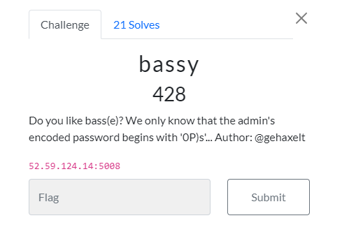

# web: bassy
solvers: [L3d](https://github.com/imL3d)  
writeup-writer: [L3d](https://github.com/imL3d)  



web source code (copy): [source.php](files/source.php)

## Solution

In this challenge we need to somehow match the admin password in order to get the flag. We don't know much about the password other than it's starting with base85 encoding starts with `0P)s`.  
We don't have much components in this challenge, so the vulnerability has to lie either in the base85 encoding, or the comparison. We can quickly rule out the base85 encryption, [it's source code](https://github.com/scottchiefbaker/php-base85) seems to do the job without any faults.  
So, the vulnerability has to be in the comparison. And as it happens, such volnerability exists in the `==` operation.  
  
The problem exists in the manner in which PHP handles handles strings when the double equal (==) operator is used to compare them, instaed of the triple equal operator (===).  
When using double equals, if both sides of the operation looks like strings of an int, PHP will take the initiative and evaluate their numeric value before comparing them. This doesn't happen while uisng `===`, as this operation will not convert the types of the operands.  
  
In our case, the decoded Admin Password starts with `0e1` - which is a numeric looks like a numeric value in it's scientific form.  
If our encoded password will also start with something that looks like a number (specifically `0`, because `0e1` in it's int form is `0`), PHP will convert those to their numric values, they will be equal, and we will bypass the check without actually knowing the password.   
  
The code to create such value, is a simple as decoding the number zero (it's encoded value will be then 0):
```php
echo base85::decode("0000");
```
The amount of `0`s that are being decoded in this case is to make sure they will be encoded to the same value (gotta love base85🤷‍♂️).  

We send this as the password, and get the flag🚩: `ENO{B4sE_85_L0l_0KaY_1337}`.  
  
Thanks for reading!
